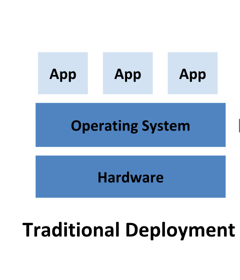
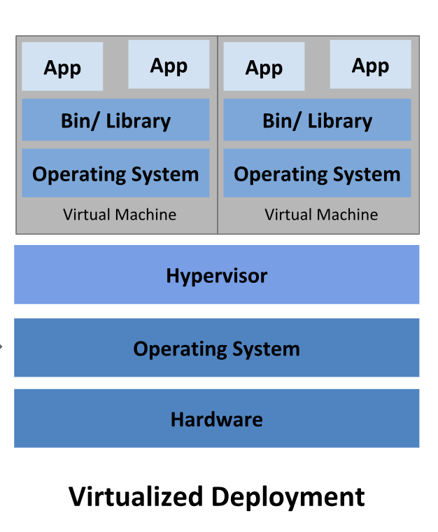
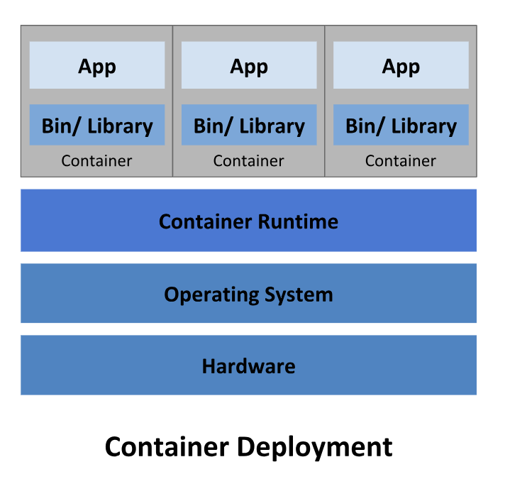
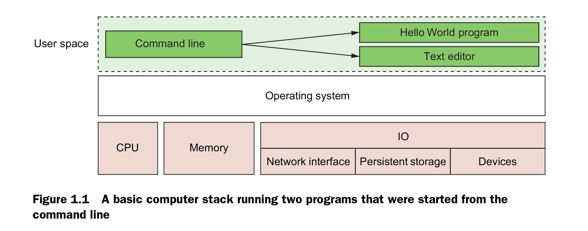
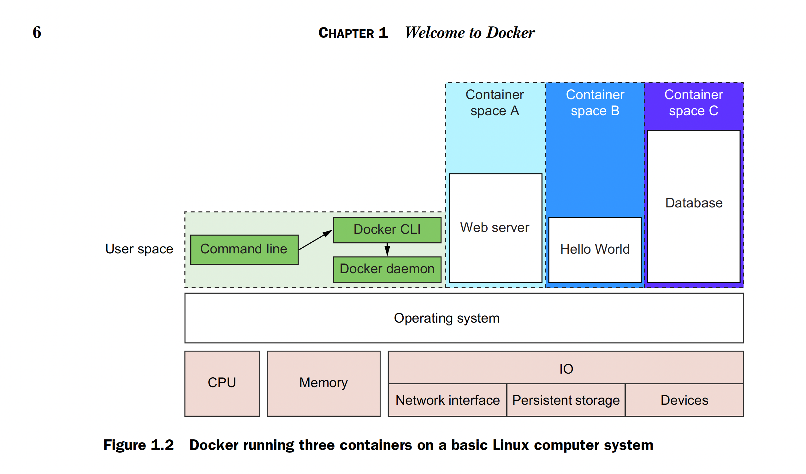
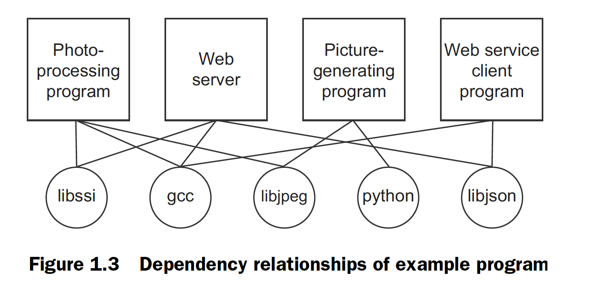
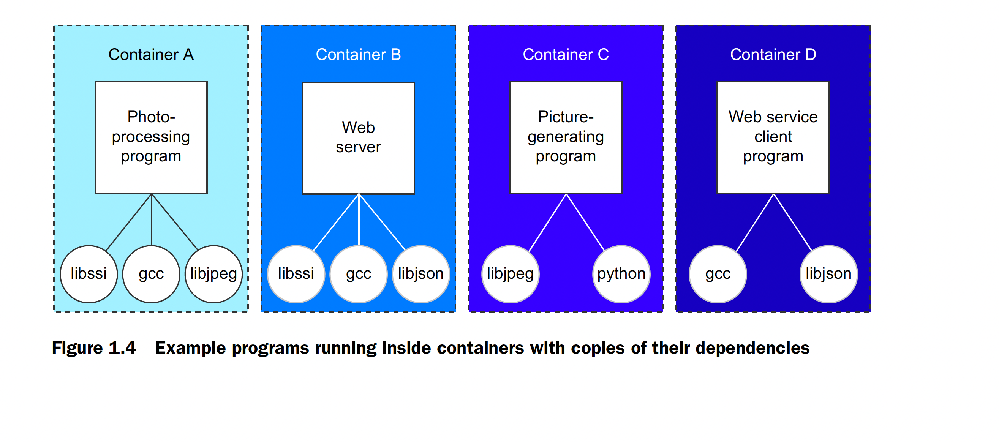
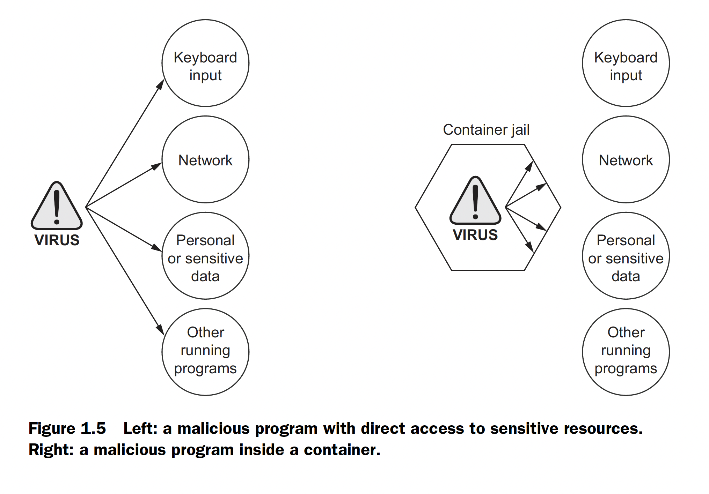

## What is Docker?

Docker is a command-line program, a background daemon, and a set of remote services
that take a logistical approach to solving common software problems and simplifying
your experience installing, running, publishing, and removing software. It
accomplishes this using a UNIX technology called containers.

## Containers are not virtualization ?

### Traditional Deployment

* Early on, organizations ran applications on physical servers. There was no way to define resource boundaries for applications in a physical server, and this caused resource allocation issues.

* For example, if multiple applications run on a physical server, there can be instances where one application would take up most of the resources, and as a result, the other applications would underperform.

* A solution for this would be to run each application on a different physical server. But this did not scale as resources were underutilized, and it was expensive for organizations to maintain many physical servers.

<picture>  </img></picture>

### Virtualization

* Without Docker --> hardware virtualization ( Vritual Machine )
* Virtual machines provide virtual hardware on which an operating system and other programs can be installed.
* They take a long time (often minutes) to create and require significant resource overhead because they run a whole copy of an operating system in addition to the software you want to use.

<picture>  </img></picture>

### Docker 

* Docker containers don’t use hardware virtualization.

* Programs running inside Docker containers interface directly with the host’s Linux kernel.Because there’s no additional layer between the program running inside the container and the computer’s operating system, no resources are wasted by running redundant software or simulating virtual hardware.

* This is an important distinction. Docker is not a virtualization technology. Instead, it helps you use the container technology already built into your operating system.

<picture>  </img></picture>

## Running software in containers for isolation 

As noted earlier, containers have existed for decades. Docker uses Linux namespaces and cgroups, which have been part of Linux since 2007.

Docker doesn’t provide the container technology, but it specifically makes it simpler to use.

### Basic Computer Stack 

Notice that the command-line interface, or CLI, runs in what is called user space memory just like other programs that run on top of the operating system

Ideally programs running in user space can’t modify kernel space memory. Broadly speaking, the operating system is the interface between all user programs and the hardware that the computer is running on.

<picture>  </img></picture>
### Docker Stack/ Architecture

Running Docker means running two programs in user space.

* The first is the Docker daemon. If installed properly, this process should always be running.

* The second is the Docker CLI. This is the Docker program that users interact with. If you want to start, stop, or install software, you’ll issue a command using the Docker program.

<picture>  </img></picture>

* Above pictures shows three running containers. Each is running as a child process of the Docker daemon, wrapped with a container, and the delegate process is running in its own memory subspace of the user space.

* Programs running inside a container can access only their own memory and resources as scoped by the container.

The containers that Docker builds are isolated with respect to eight aspects.

- [X] PID namespace—Process identifiers and capabilities
- [X] UTS namespace—Host and domain name
- [X] MNT namespace—File system access and structure
- [X] IPC namespace—Process communication over shared memory
- [X] NET namespace—Network access and structure
- [X] USR namespace—User names and identifiers
- [X] chroot()—Controls the location of the file system root
- [X] cgroups—Resource protection

* Linux namespaces and cgroups take care of containers at runtime. Docker uses another set of technologies to provide containers for files that act like shipping containers.

## Shipping containers

You can think of a Docker container as a physical shipping container. It’s a box where you store and run an application and all of its dependencies. Just as cranes, trucks, trains, and ships can easily work with shipping containers, so can Docker run, copy, and distribute containers with ease.

Docker completes the traditional container metaphor by including a way to package and distribute software. The component that fills the shipping container role is called an image.

A Docker image is a bundled snapshot of all the files that should be available to a program running inside a container.

## What problems does Docker solve?

Using software is complex.The list of considerations is long and unforgiving.Installing software is at best inconsistent and overcomplicated.Before installation you have to consider :

* What operating system you’re using
* The resources the software requires
* What other software is already installed
* What other software it depends on.
* You need to decide where it should be installed. 
* Then you need to know how to install it

Most computers have more than one application installed and running. And most applications have dependencies on other software. What happens when two or more applications you want to use don’t play well together? Disaster. Things are only made more complicated when two or more applications share dependencies:

- [X] What happens if one application needs an upgraded dependency but the other
does not?
- [X] What happens when you remove an application? Is it really gone?
- [X] Can you remove old dependencies?
- [X] Can you remember all the changes you had to make to install the software you now want to remove?

The simple truth is that the more software you use, the more difficult it is to manage. Even if you can spend the time and energy required to figure out installing and running applications, how confident can you be about your security? Open and closed source programs release security updates continually, and being aware of all of the issues is often impossible. The more software you run, the greater the risk that it’s vulnerable to attack.

All of these issues can be solved with careful accounting, management of resources, and logistics, but those are mundane and unpleasant things to deal with.

### Dependency relationships

Today, without Docker, applications are spread all over the file system and end up
creating a messy web of interactions. Figure illustrates how example applications
depend on example libraries without Docker.

<picture>  </img></picture>

Docker keeps things organized by isolating everything with containers and images.Below picture illustrates these same applications and their dependencies running inside containers. With the links broken and each application neatly contained, understanding the system is an approachable task.

<picture>  </img></picture>

### Improving portability
Docker improves the portability of every program regardless of the language it was written in, the operating system it was designed for, or the state of the environment where it’s running.

### Protecting your computer

* Like physical jail cells, anything inside a container can only access things that are inside it as well. There are exceptions to this rule but only when explicitly created by the user.
* Containers limit the scope of impact that a program can have on other running programs, the data it can access, and system resources. Figure 1.5 illustrates the difference between running software outside and inside a container.

<picture>  </img></picture>

## Why is Docker important? 

Docker provides what is called an abstraction. Abstractions allow you to work with complicated things in simplified terms. So, in the case of Docker, instead of focusing on all the complexities and specifics associated with installing an application, all we need consider is what software we’d like to install.

* Application removal: When you want to remove software, you simply tell Docker which software to remove. No lingering artifacts will remain because they were all carefully contained and accounted for. Your computer will be as clean as it was before you installed the software.

* The container abstraction and the tools Docker provides for working with containers will change the system administration and software development landscape. Docker is important because it makes containers available to everyone. Using it saves time, money, and energy.

* Docker is important is that there is significant push in the software community to adopt containers and Docker. This push is so strong that companies like Amazon, Microsoft, and Google have all worked together to contribute to its development and adopt it in their own cloud offerings. These companies, which are typically at odds, have come together to support an open source project instead of  developing and releasing their own solutions.

* Docker is important is that it has accomplished for the computer what app stores did for mobile devices. It has made software installation, compartmentalization, and removal very simple.

## Where and when to use Docker ?

Docker can be used on most computers at work and at home. Practically, how far should this be taken?

Docker can run almost anywhere, but that doesn’t mean you’ll want to do so. For
example, currently Docker can only run applications that can run on a Linux operating system. This means that if you want to run an OS X or Windows native application, you 
can’t yet do so through Docker.

