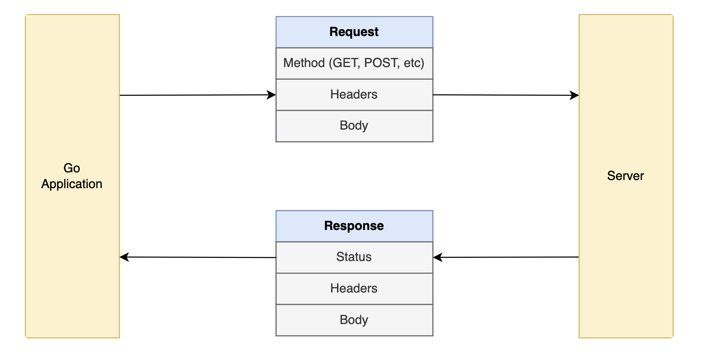

# Making REST API Requests in Golang using the HTTP Client

In most web applications, we need to make HTTP requests to external services. For example, we might need to make a request to a third-party API to fetch some data. Or we might need to make a request to our own API to create, update, or delete some data.

## Agenda 

- Making HTTP requests ( GET , POST etc)
- Setting custom headers and timeouts 
- Using JSOn in request and response bodies 

## The HTTP Client Library 

Most of the functionality for making HTTP requests is provided by the [net/http](https://pkg.go.dev/net/http) package. This package provides a [Client type](https://pkg.go.dev/net/http#Client) that we can use to make HTTP requests.

### Request and Response 
Whenever we make an HTTP request, we need to specify the HTTP method (GET, POST, etc), the URL, and the request body (if any).
In return, we get an HTTP response. The response contains the response body, the status code, and some other metadata. In Go, the response is represented by the [Response type](https://pkg.go.dev/net/http#Response).

<picture>
    
<picture>

## References :
 - [ ] [HTTP Client](https://www.sohamkamani.com/golang/http-client)
 - [ ] [net/http library](https://pkg.go.dev/net/http)
 - [ ] [HTTP Client Type ](https://pkg.go.dev/net/http#Client)
 - [ ] [http-echo-server](https://github.com/watson/http-echo-server)

