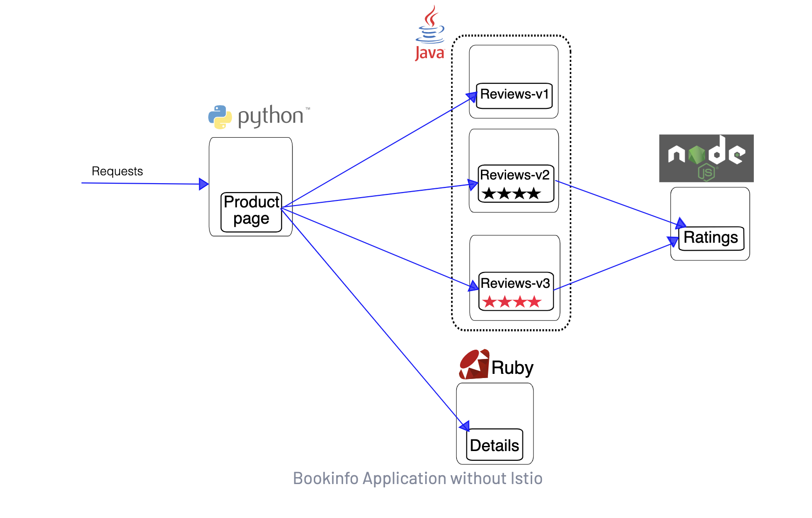

# Istio Service Mesh 


## Download and Configure Istio locally [link](https://istio.io/latest/docs/setup/getting-started/)

```
curl -L https://istio.io/downloadIstio | sh -
cd istio-1.22.0
export PATH=$PWD/bin:$PATH
istioctl install --set profile=demo -y
kubectl label namespace default istio-injection=enabled
kubectl label namespace observability istio-injection=enabled
```


## Steps

### Kind Cluster Creation 

```
$ kind create cluster --name kind-prometheus-cluster
Creating cluster "kind-prometheus-cluster" ...
 ✓ Ensuring node image (kindest/node:v1.27.3) 🖼 
 ✓ Preparing nodes 📦  
 ✓ Writing configuration 📜 
 ✓ Starting control-plane 🕹️ 
 ✓ Installing CNI 🔌 
 ✓ Installing StorageClass 💾 
Set kubectl context to "kind-kind-prometheus-cluster"
You can now use your cluster with:

kubectl cluster-info --context kind-kind-prometheus-cluster

Thanks for using kind! 😊
```
```
kubectl get pods -A                                          
NAMESPACE            NAME                                                            READY   STATUS    RESTARTS   AGE
NAMESPACE            NAME                                                            READY   STATUS    RESTARTS   AGE
kube-system          coredns-5d78c9869d-ntllx                                        1/1     Running   0          37s
kube-system          coredns-5d78c9869d-qj5w7                                        1/1     Running   0          37s
kube-system          etcd-kind-prometheus-cluster-control-plane                      1/1     Running   0          51s
kube-system          kindnet-27qpz                                                   1/1     Running   0          38s
kube-system          kube-apiserver-kind-prometheus-cluster-control-plane            1/1     Running   0          51s
kube-system          kube-controller-manager-kind-prometheus-cluster-control-plane   1/1     Running   0          51s
kube-system          kube-proxy-wx7wf                                                1/1     Running   0          38s
kube-system          kube-scheduler-kind-prometheus-cluster-control-plane            1/1     Running   0          51s
local-path-storage   local-path-provisioner-6bc4bddd6b-r699j                         1/1     Running   0          37s
```

### Istio Services Installation 

```
$istioctl install --set profile=demo -y
✔ Istio core installed
✔ Istiod installed
- Processing resources for Egress gateways, Ingress gateways. Waiting for Deployment/istio-system/istio-egressgateway, Deployment/istio-system/istio-ingressgateway
✔ Ingress gateways installed
✔ Egress gateways installed
✔ Installation complete
Made this installation the default for injection and validation.
```

### Enable namespace istio injection
```
kubectl create namespace observability 
kubectl label namespace observability istio-injection=enabled
```
### Install Sample Bookinfo application [link](https://istio.io/latest/docs/examples/bookinfo/)

This example deploys a sample application composed of four separate microservices used to demonstrate various Istio features.

<picture>
</img>
</picture>

This application is polyglot, i.e., the microservices are written in different languages. It’s worth noting that these services have no dependencies on Istio, but make an interesting service mesh example, particularly because of the multitude of services, languages and versions for the reviews service.

```
kubectl apply -f /Users/kumarro/go/src/GO_Projects/observability/bookinfoapp/bookinfo.yaml
kubectl get services
kubectl get pods
kubectl exec "$(kubectl get pod -l app=ratings -o jsonpath='{.items[0].metadata.name}')" -c ratings -- curl -sS productpage:9080/productpage | grep -o "<title>.*</title>"
kubectl apply -f /Users/kumarro/go/src/GO_Projects/observability/bookinfoapp/bookinfo-gateway.yaml 
kubectl get gateway
```

```
export INGRESS_NAME=istio-ingressgateway
export INGRESS_NS=istio-system
echo $INGRESS_NAME
echo $INGRESS_NS
kubectl get svc "$INGRESS_NAME" -n "$INGRESS_NS"
```

### Configure LoadBalancer for Kind [link](https://kind.sigs.k8s.io/docs/user/loadbalancer/)

[Link2](https://medium.com/groupon-eng/loadbalancer-services-using-kubernetes-in-docker-kind-694b4207575d)
```
export INGRESS_HOST=$(kubectl -n "$INGRESS_NS" get service "$INGRESS_NAME" -o jsonpath='{.status.loadBalancer.ingress[0].ip}')
export INGRESS_PORT=$(kubectl -n "$INGRESS_NS" get service "$INGRESS_NAME" -o jsonpath='{.spec.ports[?(@.name=="http2")].port}')
export SECURE_INGRESS_PORT=$(kubectl -n "$INGRESS_NS" get service "$INGRESS_NAME" -o jsonpath='{.spec.ports[?(@.name=="https")].port}')
export TCP_INGRESS_PORT=$(kubectl -n "$INGRESS_NS" get service "$INGRESS_NAME" -o jsonpath='{.spec.ports[?(@.name=="tcp")].port}')
```

### Install Kiali [link](https://istio.io/latest/docs/ops/integrations/kiali/)
```
kubectl apply -f https://raw.githubusercontent.com/istio/istio/release-1.22/samples/addons/kiali.yaml
```


